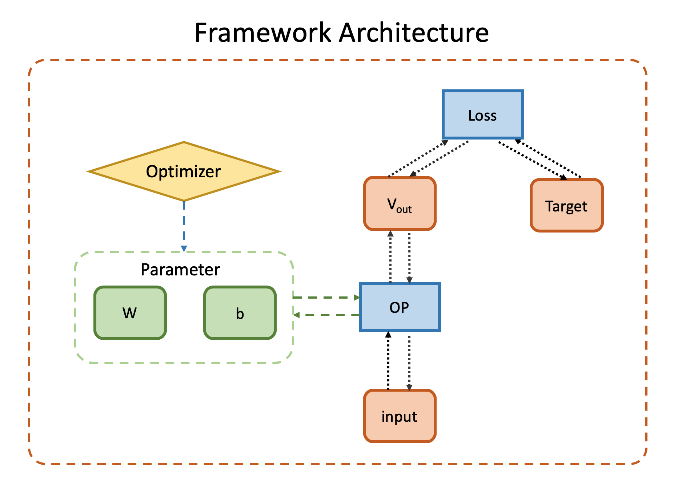

# pytensor: A Deep Learning Framework with pure numpy

pytensor is a deep learning framework implemented with pure numpy.

## Features

The framework is a toy framework implemented by pure numpy.

* It is a dynamic framework which graph can be re-constructed each time when computing forward.
* Users can use it to construct computational graph by connecting operations (as tensorflow and popular frameworks do)
* Auto differentiation is supported, so it is not necessary to implement backward computation by yourself
* Common operations used in NLP and speech is available such as embedding and lstm operations.  



## Install

To install From this repository (recommended):

	git clone https://github.com/xinjli/pytensor
	python setup.py install

This project is also on [pypi](https://pypi.python.org/pypi/pytensor>)

To install from pypi:

	pip install pytensor

## Tutorial

The architecture of pytensor is shown in the previous diagram. 
Its actual implementaion is described in my [blog](http://www.xinjianl.com)

To build a model (*graph*) with pytensor, the basic steps are as follows
* feed input and targets as *tensors*
* forward *tensors* with *operations* and *loss*
* backward gradients
* optimize

### Tensor
*tensor* can be initialized as follows.

```
In [1]: from pytensor import *

In [2]: import numpy as np

In [3]: v = tensor(np.random.random(5), name='hello')

In [4]: print(v)
tensor {name: hello}
- value    : [0.67471201 0.06407413 0.78337818 0.39475087 0.76176572]
- gradient : [0. 0. 0. 0. 0.]
```

### Operation

Following operations are implemented currently or planned to become available

* Arithmetic operations
  * Addition
  * Multiply
  * Matmul

* Nonlinear operations
  * Relu
  * Sigmoid
  * Tanh
  
* Loss operations
  * Softmax CE Loss 
  * Square Loss

* MLP-related operations
  * Affine
  
* NLP-related operations
  * embedding
  * RNN
  * LSTM
  
### Loss
Loss is a special type of operation which should implement *loss* method in addition to the *forward* and *backward*.
Following loss are implemented currently.

* Softmax CE Loss 
* Square Loss
* CTC (not included yet, prototype is available under the ctc branch)

### Graph
To implement a model, we need to inherit the Graph class, and then implement two methods *forward* and *loss*.
*forward* should specify how the model should produce outputs from inputs, and *loss* should implement the logic of loss function.

To train a model, it is highly recommended to initialize *tensor*, *operation* and *loss* using *get_operation* and *get_tensor* interfaces.
This is to ensure that *tensor* and *operation* are registered and managed by *graph* automatically.
Otherwise, their gradients and updates should be handled manually.

Here we show a example of simple MLP model.

```python
from pytensor import *
from pytensor.network.trainer import *
from pytensor.data.digit_dataset import *


class MLP(Graph):

    def __init__(self, input_size, hidden_size, output_size):
        super().__init__("mlp")

        # make graph
        self.affine1 = self.get_operation('Affine', {'input_size': input_size, 'hidden_size': hidden_size})
        self.sigmoid = self.get_operation('Sigmoid')
        self.affine2 = self.get_operation('Affine', {'input_size': hidden_size, 'hidden_size': output_size})
        self.softmaxloss = self.get_operation('SoftmaxLoss')

    def forward(self, input_tensor):
        affine1_tensor = self.affine1.forward(input_tensor)
        sigmoid_tensor = self.sigmoid.forward(affine1_tensor)
        affine2_tensor = self.affine2.forward(sigmoid_tensor)

        return self.softmaxloss.forward(affine2_tensor)

    def loss(self, target_tensor):
        return self.softmaxloss.loss(target_tensor)


# load digit data for multiclass classification
data_train, data_test, label_train, label_test = digit_dataset()

# create a MLP model with dimensions of 64 input, 30 hidden, 10 output 
model = MLP(64, 30, 10)

# create a trainer
trainer = Trainer(model)

# train 40 epoch
trainer.train(data_train, label_train, data_test, label_test, 40)
```
  
### Customization

Basically, we can add new operations to support more features. 
To implement a new operation, we need to support *forward* and *backward* interfaces.
Be sure to call *register* interface in forward if your backward is not empty.
This is to register the operation so that backward will be called automatically during backpropagation.

For examples, here is the default addition operation.

```python
class Add(Operation):

    def __init__(self, name='add', argument=None, graph=None):
        super(Add, self).__init__(name, argument, graph)


    def forward(self, input_tensors):
        """
        Add all tensors in the input_tensor

        :param input_tensors:
        :return:
        """
        self.register(input_tensors)

        # value for the output tensor
        value = np.zeros_like(self.input_tensors[0].value)

        for input_tensor in self.input_tensors:
            value += input_tensor.value

        self.output_tensor = tensor(value)

        return self.output_tensor

    def backward(self):
        """
        backward grad into each input tensor

        :return:
        """

        for input_tensor in self.input_tensors:
            input_tensor.grad += self.output_tensor.grad
```

### Tests

You can implement unit test to validate your model and operations are working.

Sample tests are available in pytensor.test. You can run those existing tests with following commands

 
	python -m pytensor.test.test_linear
	python -m pytensor.test.test_mlp
	python -m pytensor.test.test_rnn
	python -m pytensor.test.test_lstm